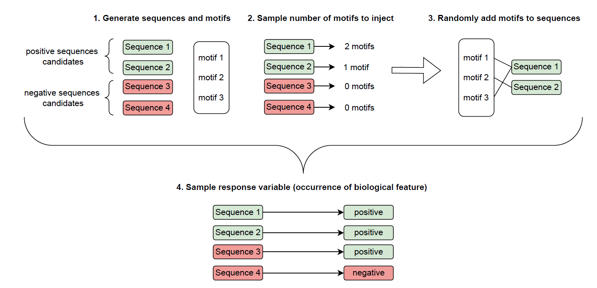

```{r, include = FALSE}
knitr::opts_chunk$set(
  collapse = TRUE,
  comment = "#>",
  fig.width = 5,
  fig.align = 'center'
)
```


\maketitle

## Sequence data simulation

We generate $n$ sequences $s_1, \ldots, s_n$ of length $N$ based on real frequences of amino acids on full alphabet.

```{r, echo=FALSE, message=FALSE, warning=FALSE}
library(kableExtra)

letter_matrix <- matrix(c(
  'A', 'L', 'A', 'V', 'P', 'H', 'G', 'K', 'T', 'F',
  'S', 'L', 'Q', 'W', 'E', 'P', 'V', 'L', 'D', 'T',
  'R', 'I', 'F', 'N', 'N', 'V', 'Q', 'G', 'A', 'A',
  'G', 'C', 'S', 'D', 'G', 'Y', 'D', 'Q', 'T', 'R',
  'Y', 'L', 'R', 'R', 'S', 'R', 'P', 'D', 'A', 'V',
  'N', 'V', 'S', 'M', 'M', 'T', 'R', 'G', 'D', 'I'
), nrow = 6, byrow = TRUE)

letter_df <- as.data.frame(letter_matrix)

kable_paper(kbl(letter_df, row.names = FALSE, col.names = NULL,
                caption = "Example sequences of length 10."), full_width = F)
```


## Motif generation

We generate a set of $m$ motifs ($m_1, \ldots, m_m$) with the following parameters:

\begin{itemize}
    \item $n_m$: denoting maximum number of letters in motif
    \item $d_m$: denoting maximum number of gaps in motif
\end{itemize}


```{r, echo=FALSE}

motif_matrix <- matrix(c(
  'A', '_', '_', 'B', '', '', '', '',
  'Y', 'L', '_', 'G', '_', '_', 'D', '',
  'N', '_', '_', '_', '_', 'M', '', '',
  'A', 'B', '_', 'T', '', '', '', ''
), nrow = 4, byrow = TRUE)

motif_df <- as.data.frame(motif_matrix)

kable_paper(
    kbl(motif_df, row.names = FALSE, col.names = NULL,
        caption = "Example motifs."), full_width = F
)
```


## Motif injection

We inject motif by replacing a randomly selected part of a sequence with this motif. For example:


```{r, echo=FALSE}

sequences_matrix <- matrix(c(
  'A', 'L', 'A', 'V', 'P', 'H', 'G', 'K', 'T', 'F',
  'S', 'L', 'Q', 'W', 'E', 'P', 'V', 'L', 'D', 'T',
  'R', 'I', 'F', 'N', 'N', 'V', 'Q', 'G', 'A', 'A',
  'G', 'A', 'B', 'D', 'T', 'Y', 'D', 'Q', 'T', 'R',
  'Y', 'L', 'R', 'R', 'S', 'R', 'A', 'B', 'A', 'T',
  'N', 'V', 'A', 'B', 'M', 'T', 'R', 'G', 'D', 'I'
), nrow = 6, byrow = TRUE)

sequences_df <- as.data.frame(sequences_matrix)

kbl(sequences_df, col.names = NULL, row.names = FALSE, align = 'c', 
      caption = "Example sequences of length 10 with addition of motif AB_T") |>
  row_spec(4, background = "lightgreen") |>
  row_spec(5, background = "lightgreen") |>
  row_spec(6, background = "lightgreen") |>
  kable_paper(full_width = F)

```


\noindent  We inject from $0$ to $k$ motifs to a single sequence according to the following procedure:

\begin{enumerate}
    \item Set the ratio $r_m$ of sequences with at least one motif.
    \item For each sequence $s_i$ sample a number of motifs to inject as follows:
$$k_i \in \left\{\begin{array}{cl}
\lbrace 1, 2, \ldots, k\rbrace, & 1 < i \leq \lfloor n \cdot r_m\rfloor  \\
\lbrace 0\rbrace, & \lfloor n \cdot r_m\rfloor  < i \leq n
\end{array} \right.$$
    \item For $s_i$ sample $k_i$ motifs from set $\lbrace m_1, \ldots, m_m\rbrace$

\end{enumerate}

{width=100%}

## Target variable sampling

\noindent Let's define a random variable $X_K$ on a set of sequences $s_1, \ldots, s_n$ which describes whether a sequence $K$ is a subsequence of $s_i$. Namely, for any sequence $s_i$:

$$X_K(s_i) = \left\{\begin{array}{rl}
1, & K \subseteq s_i\\
0, & \text{otherwise}
\end{array} \right.$$

\noindent where $K \subseteq s_2$ means that $K$ is a subsequence of $s_2$. For example

$$X_{AB}(ABCD) = 1,$$
$$X_{A\_B}(ABCD) = 0.$$

### Logistic regression

In this case we consider a standard logistic regression model where the joint effect of all motifs is the sum of their individual effects. Let $w_1, \ldots, w_m$ be weights related to motifs $m_1, \ldots, m_m$. Let $w_0$ be an effect for the sequences without motifs. Then, we can define an additive logistic model as follows:

$$g(EY) = w_0 + w_1 X_{m_1} + w_2 X_{m_2} + \ldots + w_m X_{m_m}$$
We assume some particular values of $w_1, \ldots, w_m$ and calculate vector of probabilities $p$ as follows:

$$p = g^{-1}(w_0 + w_1 X_{m_1} + w_2 X_{m_2} + \ldots + w_m X_{m_m}).$$
Having $p$ we simulate $y_i$ from binomial distribution $B(1, p_i)$.

### Logistic regression with interactions

Another approach is based on interactions indicating that the effect of one predictor depends on the value of another predictor. Let's define maximum number of motifs per sequence $k = \max\lbrace k_i, i = 1, \ldots, n\rbrace$. Let $w_{1}, \ldots, w_{k}$ denote weights of single effects. Namely:

$$g(EY) = w_0 + \sum_{i = 1}^{k} w_{i} X_{m_i} + \left(\sum_{i = 1}^{k-1}\sum_{j = i + 1}^{k} w_{ij} X_{m_i}X_{m_j}\right) + \ldots + w_{1\ldots k} X_{m_1}\ldots X_{m_k}$$

### Logic regression

Here, we consider new variables, $L_1, \ldots, L_l$ where each of them is a logic expression based on a subset of motifs $m_1, \ldots, m_m$. For example, $$L_1(m_1, m_2, m_3) = (X_{m_1} \land X_{m_2}) \lor X_{m_3}.$$ Each variable $L_i$ obtains its own weight in the model. Our model is following:

 $$g(EY) = w_0 + \sum_{i = 1}^{l} w_i L_i.$$


